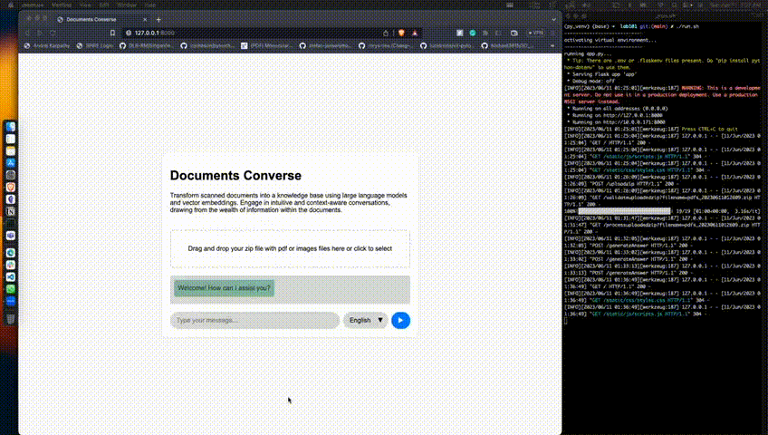

# Documents Converse

This project aims to create an innovative and user-friendly solution for navigating, scanning, and digitizing government documents, making them easily readable and searchable. By leveraging powerful technologies such as Google Cloud Platform's Document AI, OpenAI's Language Models, Pinecone vector database, and web scraping techniques, this tool simplifies interactions with government documents, facilitating better decision-making, improved public services, and enhanced citizen engagement.

## Table of Contents

- [System Design](#system_design)
- [Installation](#installation)
- [Demo](#demo)
- [License](#license)

## System Design


The high-level view of system design comprises four main components:

1. **Document AI:** Utilizing Google Cloud Platform's Document AI API to convert PDF/Image documents into text format, thereby enabling easier processing and analysis.
2. **OpenAI:** Employing a Language Model to generate embeddings for each extracted text. These embeddings capture the semantic representation of the text, allowing for effective document analysis and comparison.
3. **Pinecone:** Using Pinecone, a robust indexing and similarity search system, to store the generated embeddings. This leads to faster searches for documents matching a user's query based on semantic similarity.
4. **Flask App:** Building a responsive web application as a user interface to enable interaction between users and the backend system for query submission and accessing relevant search results.

## Installation

1. Clone the repository
```bash
git clone https://github.com/tasheer10/documents-converse
```

2. Install the required packages and run the Flask app
```bash
cd documents-converse
./run.sh
```

## Demo



## License
[MIT License - Copyright (c) 2023 Subramanya Nagabhushanaradhya, Tasheer Hussain B](LICENSE)